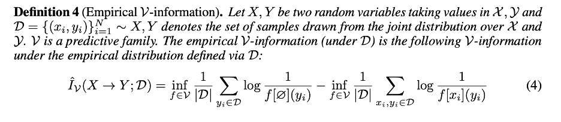
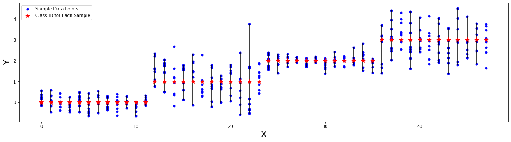

[Source](https://openreview.net/forum?id=r1eBeyHFDH)


```python
import numpy as np
from scipy.stats import norm
import matplotlib.pyplot as plt
```

#### Dataset Distribution
- Let us assume we have $J$ data samples and each sample includes $I$ features.
- Let us consider a synthetic dataset of pairs $(X^j \in \mathbb{R}^N,y^j \in \mathbb{N})$.
- Let us assume each $x^j_i \in \mathbb{R}$ comes from a normal distribution of the form $\mathcal{N}(\mu^j, \sigma^j)$


```python
def get_dataset(mus, sigmas, features, samples):
    X = np.array([[np.random.normal(mu, sigma, features) for _ in range(samples)] 
                  for mu, sigma in zip(mus, sigmas)]).reshape(samples*len(mus),features)
    Y = np.array([[mu]*samples for mu in mus]).reshape(samples*len(mus))
    return X, Y.astype(int)
```


```python
mus = [0, 1, 2, 3]
sigmas = [.25, .75, .25, .75]
features = 8
samples_per_class = 12

X, Y = get_dataset(mus, sigmas, features, samples_per_class)
print("Dataset:", X.shape, Y.shape)
```

    Dataset: (48, 8) (48,)


```python
print("Sample Data:",X[20], "\n Label:", Y[20])
```

    Sample Data: [1.71432794 0.0621263  0.69015773 0.33278509 1.53157783 1.41363028
     1.79801212 1.38835387] 
     Label: 1


```python


plt.figure(figsize=(20,5))
for i in range(features):
    if i == 0:
        plt.plot(X[:,i], "bo", markersize=5, label = "Sample Data Points")
    else:
        plt.plot(X[:,i], "bo", markersize=5)
plt.plot((range(len(X)),range(len(X))),(X.min(1), X.max(1)),c='black')
plt.plot(Y, "r*", label= "Class ID for Each Sample", markersize=10)

plt.xlabel("X",size =20)
plt.ylabel("Y",size =20)
plt.legend()
```


    <matplotlib.legend.Legend at 0x132a4dbe0>





```python
def get_best_estimation_of_probability(Y):
    ## Uniform prior
    _u, _l = np.unique(Y, return_inverse=True)    
    return np.histogram(_l, bins=np.arange(_u.size+1))[0][_l] / _l.size

def get_best_estimation_of_conditional_probability(X,Y):
    ## We assume having a sample data point, we can use its mean and std 
    ## as the emperical parameters to calcualte probability of each label.
    return np.array([norm(loc=X[i].mean(), scale=X[i].std()).pdf(np.unique(Y))[Y[i]] for i in range(X.shape[0])])

def get_v_entropy(Y):
    f_null_Y = get_best_estimation_of_probability(Y)
    log_value = -np.log(f_null_Y)
    inf_value = log_value.sum()/len(Y)
    return inf_value

def get_cond_v_entropy(X, Y):
    f_X_Y = get_best_estimation_of_conditional_probability(X,Y)
    log_value = -np.log(f_X_Y)
    inf_value = log_value.sum()/len(Y)
    return inf_value
```


```python

v_entropy = get_v_entropy(Y)
print("First Term: ",v_entropy)

cond_v_entropy = get_cond_v_entropy(X, Y)
print("Second Term: ", cond_v_entropy)

print("v_information (X, Y; dataset):", v_entropy - cond_v_entropy)
```

    First Term:  1.3862943611198906
    Second Term:  0.07333072640952766
    v_information (X, Y; dataset): 1.3129636347103628


